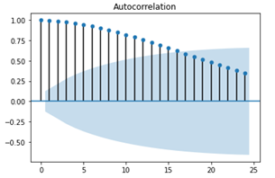
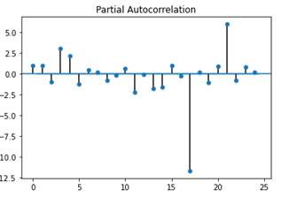
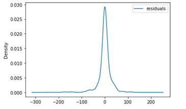

# COVID-19

Introduction
  
COVID-19 is the biggest issue currently facing the world, people of all ages and locations are being affected by this virus. As governments strategise about how to deal with this virus and when to implement conditions such as nationwide lockdowns, predictive analysis is becoming much more relevant. In this project we look to create an ARIMA model to forecast future COVID-19 mortalility in the UK. In addition to this many COVID-19 naysayers repeatedly point to previous flu mortality rates when attempting to downplay the significance of COVID-19 mortalilty rates. So to test the viablilty of this argument we look to implement 2 sample t-test to see if there is any significant difference between COVID-19 mortality and total mortality in the UK.

Data gathering and preprocessing

All data used in this project was obtained from ONS. We used 2 datasets in total. The first dataset showed daily deaths rates for flu and COVID in 2020, the other dataset showed monthly death rates of all causes from 2015 till present in the UK. Datasets can be found here: https://www.ons.gov.uk/peoplepopulationandcommunity/birthsdeathsandmarriages/deaths/datasets/monthlyfiguresondeathsregisteredbyareaofusualresidence 

Some preprocessing was required for this data. To be able to plot and perform the t-test between total deaths and COVID deaths we had to put both datasets into one dataframe. First we summed up and grouped the COVID data by month so it could have the same intervals as the total deaths data. Then we replaced the string names so it would match that of total deaths datasets. Once the date column was the same for both of these datasets, we merged the datsets on the date column.

Visualizations
  
To perform some preliminary data exploration we produced some line graphs and bar chart for daily mortality mortality.
First we look daily flu deaths against daily COVID deaths on the same graph. We can see flu seems to flatten out where as COVID spikes in April.
  

Next we look at Total monthly deaths spanning back to 2015 against monthly COVID deaths. You can see that COVID seems to have some noticable impact on overall deaths, as deaths increase visibly during the pandemic.

Lastly we look at the same data shown above but in barchart form for clarity.

T-test
 
First analyis we performed was 2 sample T-test, where we looked at total UK monthly deaths in 2020 (During COVID) compared to total UK monthly deaths prior to 2020 reaching back to 2015. We found a T-value of 0.70617961 and P-value of 0.49713953. We can see there is a difference however becuase the P-value is greater than 0.05 this difference is not signifance. We can therefore conclude based on the data there is no siginificant difference between total UK death rates during the pandemic and previous years. 

ARIMA
  
Here we used UK COVID-19 daily mortality as our time series. First we produced ACF and PACF plots to get an idea of what to set for the parameters.  

The ACF seems to follow a decreasing pattern but never reaches zero, from this we infer some differencing is required so we will set differencing to 1. After differncing we then plot ACF and PACF again, we can see these plots below.

From the differenced ACF and PACF we can see that they both spike at lag 1 therefore we change AR and MA to 1 also so our model becomes ARIMA(1,1,1).

Above we plotted the resiudals for the model and we can see the data follows a normal distribution so we can say almost all the patterns have been removed from the data. Also our model had AR error 0.025 and MA error 0.041 which very low, so we can say this model is effective.

Lastly we created a forecast to predict what deaths would be in the near future. We can a small dip for a few days and then the number of deaths increases sharply in the shape of a parabola. 
